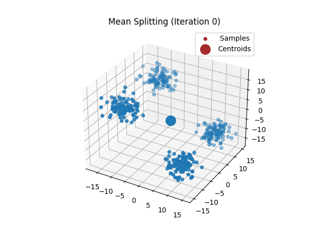

# K-Means-Clustering
 A library for K Means Clustering

## Clustering

K means clustering is an unsupervised machine learning algorithm. In unsupervised learning, there is no ground truth
or labels in the dataset. The clusters or classes are inferred from similar features or structure in the data. 

## K Means Algorithm
K means is an iterative algorithm to find k optimal centroids to split the data into clusters. Ideally, each cluster 
contains high correlation among the data points.

The algorithm works by a 2 step iterative process obtained from the Expectation-Maximization (EM) algorithm.
1) Assign data points to the closest centroid (least euclidean distance)
2) Recompute the mean of the centroid by averaging over the data points that belong to that centroid.

## Initializing the centroids
There are multiple ways of initializing the centroids. In the code, 2 methods are implemented.
1) Initialize the centroids to k randomly selected data points
2) Mean-Splitting

The first method assigns k centroids randomly from the dataset. This method disregards the spatial structure of the data
while initializing the centroids. The algorithm may get stuck in a local optimum and may not converge to a global optimum.
Therefore, different initializations may lead to better results.

The second method accounts for the spatial structure of the data while initializing the centroids. In this method, k 
means is performed iteratively as we increase k from 1 to k.
1) For k=1, compute the mean of all the points
2) For k=2, perturb the mean randomly
 

# Gifs

 
 